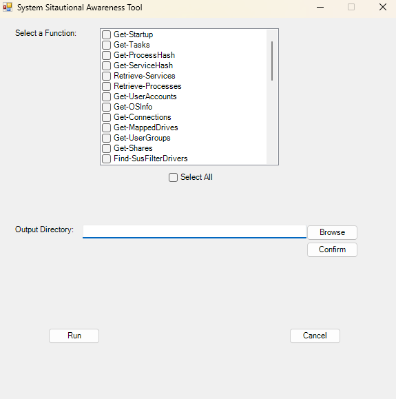

# SystemSA
System Situational Awareness

##  What is it?

This tool is a GUI that streamlines the use of the underlying machine investigation functions

## Usage

Run the powershell script, it includes the underlying functions as well as the GUI.

```
.\SystemSAFullTool.ps1
```

This will launch the GUI where you can select the functions you want to run - please note that some of the functions require local admin

.
