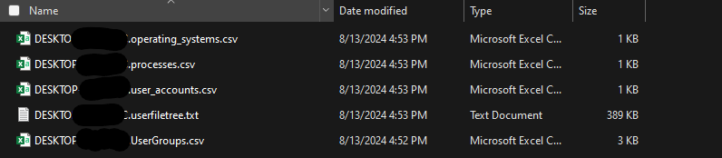

# SystemSA
System Situational Awareness

##  What is it?

This tool is a GUI that streamlines the use of the underlying machine investigation functions

## Usage

Run the powershell script, it includes the underlying functions as well as the GUI.

```
.\SystemSAFullTool.ps1
```

This will launch the GUI where you can select the functions you want to run - please note that some of the functions require local admin


From here you can select any combination of functions by clicking the checkbox or use the select all button.

Then you will need to browse the folder you wish to save your output to. Once you select the folder you need to click confirm.

After you confirm the functions and the output folder, you click run and the functions you selected will run and save the output to your desired destination in a series of text and csv files.

Output Example:



Happy Hunting!
